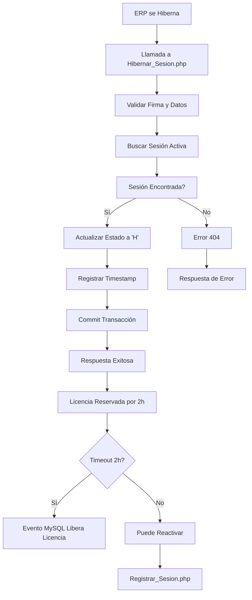

# API de Hibernación de Sesiones ERP

## Descripción General

El endpoint `Hibernar_Sesion.php` permite marcar las sesiones del ERP como hibernadas cuando el sistema se va a hibernar, manteniendo las licencias reservadas temporalmente. El despertar se maneja mediante `Registrar_Sesion.php` cuando se necesita reactivar la sesión. Las licencias se liberan automáticamente después de 2 horas de hibernación mediante un evento MySQL.

## Información del Endpoint

- **URL**: `/apis/Hibernar_Sesion.php`
- **Método**: POST
- **Content-Type**: `application/json`
- **Zona Horaria**: America/Guayaquil

## Propósito

Este endpoint es parte del sistema de gestión de licencias y sesiones ERP, diseñado para:
- Marcar sesiones activas como hibernadas
- Mantener licencias reservadas temporalmente durante períodos de inactividad
- Mantener un registro del estado de hibernación de las sesiones
- Permitir la reactivación mediante nuevo registro de sesión cuando se necesite

## Parámetros de Entrada

### Requeridos
- `RUC` (string): Número de RUC de la empresa
- `ping_token` (string): Token de autenticación de la sesión

### Opcionales
- `Serie` (string): Número de serie del dispositivo/ERP

## Estructura de la Petición

```json
{
    "RUC": "1234567890001",
    "ping_token": "abc123def456ghi789",
    "Serie": "ERP001"
}
```

## Validaciones

1. **Firma de Petición**: Se valida la autenticidad de la petición mediante `Validar_Firma.php`
2. **Datos Requeridos**: Se verifica que `RUC` y `ping_token` estén presentes
3. **Sesión Activa**: Se confirma que la sesión existe y está activa en la base de datos

## Proceso de Hibernación

1. **Validación de Entrada**: Se verifica la firma y los datos de entrada
2. **Búsqueda de Sesión**: Se localiza la sesión activa en la base de datos
3. **Actualización de Estado**: Se marca la sesión como hibernada ('H')
4. **Registro de Timestamp**: Se registra la fecha y hora de hibernación
5. **Commit de Transacción**: Se confirma la operación en la base de datos

## Respuesta Exitosa

### Código de Estado: 200 OK

```json
{
    "Fin": "OK",
    "Mensaje": "Sesión hibernada exitosamente.",
    "ping_token": "abc123def456ghi789",
    "estado": "H",
    "sesion": {
        "tipo": "ERP",
        "usuario": "ERP",
        "fecha_inicio": "2024-01-15 10:30:00"
    }
}
```

## Respuestas de Error

### 400 Bad Request - Datos Incompletos
```json
{
    "Fin": "Error",
    "Mensaje": "Datos incompletos: RUC y ping_token son requeridos."
}
```

### 404 Not Found - Sesión No Encontrada
```json
{
    "Fin": "Error",
    "Mensaje": "Sesión no encontrada o token inválido."
}
```

### 500 Internal Server Error - Error de Base de Datos
```json
{
    "Fin": "Error",
    "Mensaje": "Error al hibernar la sesión."
}
```

## Estructura de Base de Datos

### Tabla: `sesiones_erp`

| Campo | Tipo | Descripción |
|-------|------|-------------|
| `id` | INT | Identificador único de la sesión |
| `Ruc` | VARCHAR | Número de RUC de la empresa |
| `ping_token` | VARCHAR | Token de autenticación |
| `tipo` | VARCHAR | Tipo de sesión (ERP, etc.) |
| `usuario` | VARCHAR | Usuario de la sesión |
| `estado` | CHAR(1) | Estado: 'A'=Activa, 'H'=Hibernada |
| `fecha_inicio` | DATETIME | Fecha de inicio de la sesión |
| `fecha_hibernacion` | DATETIME | Fecha de hibernación |
| `ultima_actividad` | DATETIME | Última actividad registrada |

## Flujo de Trabajo



## Dependencias

- `Debug_Config.php`: Configuración de logs de depuración
- `Conectar_BD.php`: Conexión a la base de datos
- `Validar_Firma.php`: Validación de autenticidad de la petición

## Logs y Debug

El endpoint incluye logs de depuración detallados para:
- Inicio del proceso de hibernación
- Validación de sesión
- Confirmación de hibernación
- Commit de transacción
- Envío de respuesta
- Errores y rollbacks

## Consideraciones de Seguridad

1. **Validación de Firma**: Todas las peticiones deben ser validadas mediante `Validar_Firma.php`
2. **Transacciones**: Se utilizan transacciones de base de datos para garantizar consistencia
3. **Rollback Automático**: En caso de error, se revierten automáticamente los cambios
4. **Logs de Auditoría**: Se registran todas las operaciones para auditoría

## Casos de Uso

1. **Hibernación del Sistema**: Cuando el ERP se va a hibernar por inactividad
2. **Mantenimiento Programado**: Durante períodos de mantenimiento del sistema
3. **Gestión de Recursos**: Para mantener licencias reservadas temporalmente
4. **Control de Sesiones**: Para mantener un registro del estado de las sesiones
5. **Protección de Licencias**: Para evitar que otras empresas usen licencias temporalmente inactivas

## Integración con Otros Endpoints

- **Registrar_Sesion.php**: Se utiliza para reactivar sesiones hibernadas mediante nuevo registro
- **Ping_Sesion.php**: Monitorea la actividad de las sesiones activas
- **Logout_Sesion.php**: Cierra sesiones permanentemente
- **Evento MySQL**: Libera automáticamente licencias de sesiones hibernadas después de 2 horas

## Ejemplo de Implementación

```php
// Ejemplo de llamada desde el ERP
$data = [
    'RUC' => '1234567890001',
    'ping_token' => 'abc123def456ghi789',
    'Serie' => 'ERP001'
];

$response = http_post('/apis/Hibernar_Sesion.php', json_encode($data));

if ($response['Fin'] === 'OK') {
    echo "Sesión hibernada exitosamente";
} else {
    echo "Error: " . $response['Mensaje'];
}
```

## Notas de Implementación

- El endpoint utiliza transacciones para garantizar la integridad de los datos
- Se incluye manejo robusto de errores con rollback automático
- Los logs de debug están habilitados por defecto (configurable en `DEBUG_MODE`)
- La respuesta incluye información detallada de la sesión hibernada
- El estado 'H' indica que la sesión está hibernada
- **Importante**: Al hibernar se mantienen las licencias reservadas por 2 horas
- **Timeout automático**: Las licencias se liberan automáticamente después de 2 horas de hibernación
- **Reactivación**: Requiere nuevo registro de sesión mediante `Registrar_Sesion.php`

## Versión y Mantenimiento

- **Versión**: 1.0
- **Última Actualización**: Enero 2024
- **Mantenido por**: Equipo de Desarrollo ERP
- **Estado**: Activo en Producción
